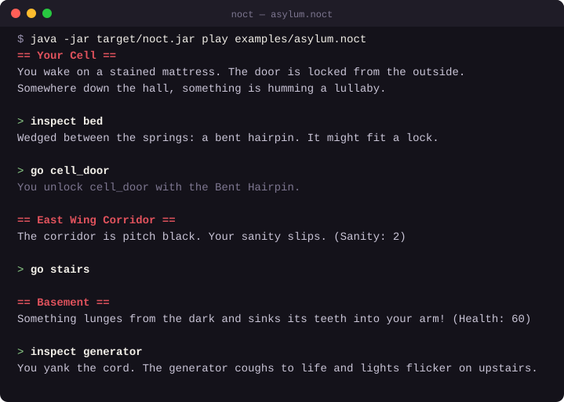

# Noct

[](https://github.com/m1tqq/noct/actions/workflows/ci.yml)


[](LICENSE)

**A small language for writing survival-horror text adventures.**

<p align="center">
  
</p>

Noct lets you describe rooms, locked doors, keys, puzzles and creeping dread
in a few lines of indentation-based script. It checks the whole scenario for
mistakes before it runs, then lets you play it in the terminal.

It is implemented from scratch in plain Java with no dependencies: a
hand-written lexer with Python-style indentation, a recursive-descent
parser, a static checker with type inference, and a tree-walking
interpreter.

```noct
item key "Rusty Key"
var health = 100
flag power = false

room cell "Cell":
    door exit -> hall locked requires key
    object bed "Iron Bed"
    object switch "Light Switch"

    on enter:
        say "You wake up on a cold floor. Health: {health}"

    on inspect bed:
        if not has(key):
            give key
            say "Something is taped under the bed. A key."

    on inspect switch:
        set power, true
        say "Somewhere, a fuse box clunks. The lights buzz on."

room hall "Hallway":
    on enter:
        if power:
            end "The lights are on. You walk out."
        else:
            end "Something in the dark finds you first."
```

## Playing

```sh
java -jar target/noct.jar play examples/asylum.noct
```

The game starts in the first room declared. At the `>` prompt, the player
types:

| Command                  | Effect                                          |
|--------------------------|-------------------------------------------------|
| `look`                   | describe the room, its objects and exits        |
| `inspect <target>`       | examine a door or object                        |
| `use <item> on <target>` | use an item you carry                           |
| `go <door>`              | walk through a door (unlocking it if you carry its key) |
| `inventory`              | list what you carry                             |
| `help` / `quit`         | list commands / leave the game                  |

[`examples/asylum.noct`](examples/asylum.noct) is a complete short game with
five rooms, two keys, a power puzzle, a sanity meter and multiple endings.
Restoring the power first matters.

## Mistakes are caught before you play

Every name, door, key and expression is checked before the game starts.
Errors point at the exact spot in the source and suggest a fix:

```
$ java -jar target/noct.jar check examples/errors/unknown-room.noct
error: unknown room 'hal'
 --> examples/errors/unknown-room.noct:5:18
  |
5 |     door exit -> hal locked requires key
  |                  ^^^
  = help: did you mean 'hall'?
```

The checker catches misspelled names, doors that lead nowhere, a flag used
where a number is expected, items used where a door is needed, duplicate
handlers, variables used before they are declared, and more. Each of these
has a small example in [`examples/errors`](examples/errors), and the full
list is in the [language reference](docs/language.md#static-checks).

## Quick start

Requires **JDK 21** and **Maven**.

```sh
git clone https://github.com/m1tqq/noct.git
cd noct
mvn package
java -jar target/noct.jar play examples/asylum.noct
```

## Command line

| Command                        | What it does                                        |
|--------------------------------|-----------------------------------------------------|
| `noct play <file>`             | Check the program, then play it interactively.      |
| `noct check <file>`            | Run all static checks and report errors.            |
| `noct tokens <file>`           | Print the token stream produced by the lexer.       |
| `noct ast <file> [--json]`     | Print the syntax tree, as a tree or as JSON.        |

Here `noct` stands for `java -jar target/noct.jar`.

`play` reads commands from standard input, so a game can be replayed from a
file of commands:

```sh
java -jar target/noct.jar play examples/asylum.noct < examples/asylum.walkthrough.txt
```

`tokens` and `ast` show what each stage of the pipeline produces, which is
handy for understanding how the language is processed:

```
$ java -jar target/noct.jar ast examples/errors/wrong-room-door.noct
program
├── room yard "Yard"
│   └── door gate -> basement (locked)
└── room basement "Basement"
    ├── door up -> yard
    ├── object lever "Rusty Lever"
    └── on inspect lever
        └── unlock gate
```

## The language in one minute

- **Declarations**: `item`, `flag` (boolean), `var` (integer) and `room`.
- **Inside rooms**: `door name -> target [locked] [requires item]`,
  `object name "Display Name"`, and event handlers.
- **Handlers**: `on enter`, `on inspect <thing>`, `on use <item> on <thing>`.
- **Actions**: `say`, `set`, `give`, `take`, `lock`, `unlock`, `end`, `if`/`else`.
- **Expressions**: integer arithmetic, comparisons, `and`/`or`/`not`, and
  `has(item)`.
- **Strings** can show live values: `say "Health: {health}"`.

Read more:

- [Language reference](docs/language.md): every construct, with examples
- [Grammar](docs/grammar.md): the full EBNF grammar
- [Design notes](docs/design.md): why the language looks the way it does

## How it works


1. **Preprocessor**: normalises line endings and tabs.
2. **Lexer**: turns text into tokens. Changes in indentation become
   synthetic `INDENT` and `DEDENT` tokens, the same technique CPython uses,
   so the parser can treat blocks like ordinary brackets. String
   interpolation (`{health}`) is split out here too.
3. **Parser**: a hand-written recursive-descent parser for an
   [LL(1) grammar](docs/grammar.md), one method per grammar rule, producing
   an abstract syntax tree of immutable Java records.
4. **Checker**: two passes over the tree. The first collects every
   declaration, so rooms and items can be used before they are declared. The
   second resolves every name and infers and checks the type of every
   expression.
5. **Interpreter**: keeps the game state (vars, flags, inventory, door
   locks, current room) and walks the tree in response to player commands.

The AST uses sealed interfaces and records, so every `switch` over node
types is checked for completeness by the Java compiler. Adding a new
action without handling it in the checker, interpreter or printers is a
compile error.

## Project structure

```
src/main/java/noct/
├── Noct.java       entry points for each pipeline stage
├── cli/            command-line tool and interactive prompt
├── preprocessor/   source normalisation
├── lexer/          tokens, indentation, string interpolation
├── parser/         recursive-descent parser, AST, tree and JSON printers
├── semantic/       symbol table, name resolution, type checking
├── interpreter/    game state, expression evaluation, player commands
└── diagnostic/     error type and Rust-style error rendering
src/test/java/      unit tests for every stage
docs/               language reference, grammar, design notes
examples/           example game, walkthrough, and one file per error kind
editors/vscode/     syntax highlighting for VS Code
```

## Testing

```sh
mvn test
```

There are unit tests for every stage of the pipeline, end-to-end tests that
play through every ending of the example game, and a test that runs every
file in [`examples/errors`](examples/errors): each one declares its
expected error on its first line (`# expect: unknown room 'hal'`) and the
test checks that the checker reports exactly that. CI runs everything on
each push and plays the example game from start to finish.

## Editor support

[`editors/vscode`](editors/vscode) contains a Visual Studio Code extension
with syntax highlighting for `.noct` files, including `{name}` interpolation
inside strings, and automatic indentation after lines ending in `:`. See its
README for installation.

## Background

Noct started as my project for the *Programming Translators* course
(Programski prevodioci) at Računarski fakultet (RAF) in Belgrade, where the
task was to design a domain-specific language and implement it end to end.
It was later rewritten, translated and extended with interactive play,
better error messages and tests. The original Serbian specification is in
[docs/original](docs/original).

## License

[MIT](LICENSE)
